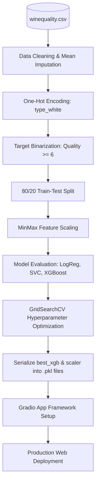

# 🍷 Wine Quality Prediction — End-to-End ML Pipeline

An end-to-end Machine Learning project that classifies wine quality based on chemical characteristics. The project encompasses comprehensive data processing, model benchmarking, automated hyperparameter tuning, model serialization, and deployment via an interactive **Gradio** web interface.

---

## 🚀 Live Demo
🔗 **Check out the interactive web application live on Hugging Face Spaces:** 
      https://rchinmay91-wine-quality-predictor.hf.space

---

## 🗺️ System Architecture Flowchart
The following diagram showcases how data flows from the raw `.csv` file through our modeling pipeline and down to the live user prediction deployment:



---

## ⚙️ How This Works (System Pipeline)

### 1. Data Cleaning & Feature Engineering
* **Missing Value Imputation:** Features showing incomplete rows (such as `fixed acidity`, `volatile acidity`, or `pH`) are dynamically filled using column-wise mean values.
* **Categorical Encoding:** The descriptive text column `type` (`red`/`white`) is parsed into explicit numerical boolean flags (`type_white`) using one-hot encoding.
* **Target Binarization:** Multi-class quality ratings (scores from 0 to 10) are transformed into a binary classification task (`best_quality`):
  * **1 (High Quality):** Wine score is 6 or higher.
  * **0 (Low Quality):** Wine score is 5 or lower.
* **Feature Normalization:** Feature distributions are scaled down to an absolute mathematical bounding interval of `[0, 1]` using a `MinMaxScaler`.

### 2. Model Benchmarking & Hyperparameter Tuning
The project trains and runs performance audits on three distinct machine learning classifiers evaluating their data validation metrics via **ROC-AUC scores**:
1. `LogisticRegression` (Baseline structural algorithm)
2. `Support Vector Classifier (SVC)` (Hyperplane classification margins)
3. `XGBClassifier` (Gradient Boosting Ensemble Decision Trees)

A full **GridSearchCV** pipeline checks 54 candidate permutations across tree boundaries (`max_depth`), learning step speeds (`learning_rate`), tree assembly arrays (`n_estimators`), and sample constraints (`subsample`) to safely isolate the absolute highest-scoring configuration.

### 3. Deployment Engine
The winning XGBoost model configuration and its companion feature scaling weights are frozen into portable binaries (`.pkl` objects) via `joblib`. The **Gradio web UI** unfreezes these objects instantly upon loading, letting web users adjust structural wine metrics using browser sliders and get predictive model results in milliseconds without re-running any training code blocks.

---

## 🛠️ Repository Architecture

```text
├── wine_quality_pipeline.py  # Cleans data, visualizes features, runs GridSearchCV, saves production assets
├── predict.py                # Standalone programmatic inference engine for offline validation batches
├── app.py                    # Production-grade user interface script driving the Gradio deployment
├── requirements.txt          # Python dependency landscape requirements declaration
├── wine_model.pkl            # Serialized production-ready optimized XGBoost model object
├── wine_scaler.pkl           # Serialized scaling asset maintaining feature matrix boundaries
└── winequality.csv           # Raw evaluation dataset file
```

---

## 📥 Local Deployment Setup

### 1. Clone the repository and navigate into the project workspace:
```bash
git clone https://github.com/[YOUR_USERNAME]/wine-quality-prediction.git
cd wine-quality-prediction
```

### 2. Install all core framework requirements:
```bash
pip install -r requirements.txt
```

### 3. Run the automated data pipeline to train and serialize the model assets:
```bash
python wine_quality_pipeline.py
```

### 4. Boot up the local Gradio user interface:
```bash
python app.py
```
Open `http://127.0.0.1:7860` in your web browser to test predictions interactively.

---

## 📜 License

Distributed under the MIT License. See `LICENSE` for more information.

```text
MIT License

Copyright (c) 2026 [YOUR_NAME]

Permission is hereby granted, free of charge, to any person obtaining a copy
of this software and associated documentation files (the "Software"), to deal
in the Software without restriction, including without limitation the rights
to use, copy, modify, merge, publish, distribute, sublicense, and/or sell
copies of the Software, and to permit persons to whom the Software is
furnished to do so, subject to the following conditions:

The above copyright notice and this permission notice shall be included in all
copies or substantial portions of the Software.

THE SOFTWARE IS PROVIDED "AS IS", WITHOUT WARRANTY OF ANY KIND, EXPRESS OR
IMPLIED, INCLUDING BUT NOT LIMITED TO THE WARRANTIES OF MERCHANTABILITY,
FITNESS FOR A PARTICULAR PURPOSE AND NONINFRINGEMENT. IN NO EVENT SHALL THE
AUTHORS OR COPYRIGHT HOLDERS BE LIABLE FOR ANY CLAIM, DAMAGES OR OTHER
LIABILITY, WHETHER IN AN ACTION OF CONTRACT, TORT OR OTHERWISE, ARISING FROM,
OUT OF OR IN CONNECTION WITH THE SOFTWARE OR THE USE OR OTHER DEALINGS IN THE
SOFTWARE.
```
